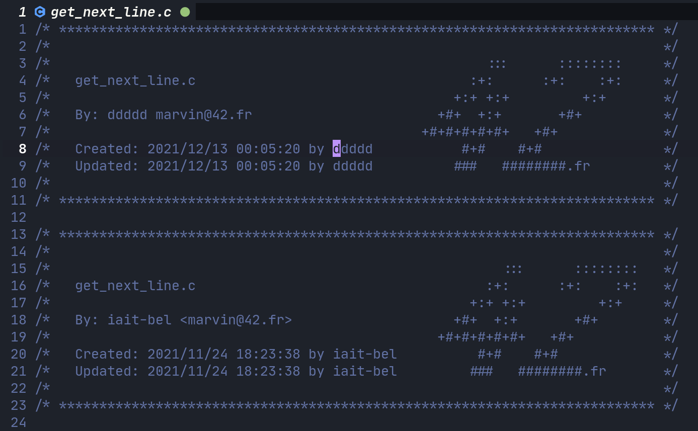

# 42 Header
1337 (Khouribga)

# Showcase


# Description
42 standard header for nvim/lua editor.

# UNIX Setup
Packer is recommended:

```
use 'abellaismail7/42header.nvim'
```

I assume that you have two env variables:

```
$USER="bella" # For your username
$USER_MAIL="bella@example.com" # For your mail
```

# Usage
In Normal mode you can use `:Ftheader`.

you might want to map it to a convient key.
nvim supplies a list of key notations with the command `:h key-notation`.

```
vim.api.nvim_set_keymap('n', '<leader>h', ': Ftheader', {noremap = true})
```

For auto header update `Updated : ...` you should add this to your config

```
vim.cmd("autocmd BufWritePre * :Ftupdate")
```

For manual update:

```
:Ftupdate
```
